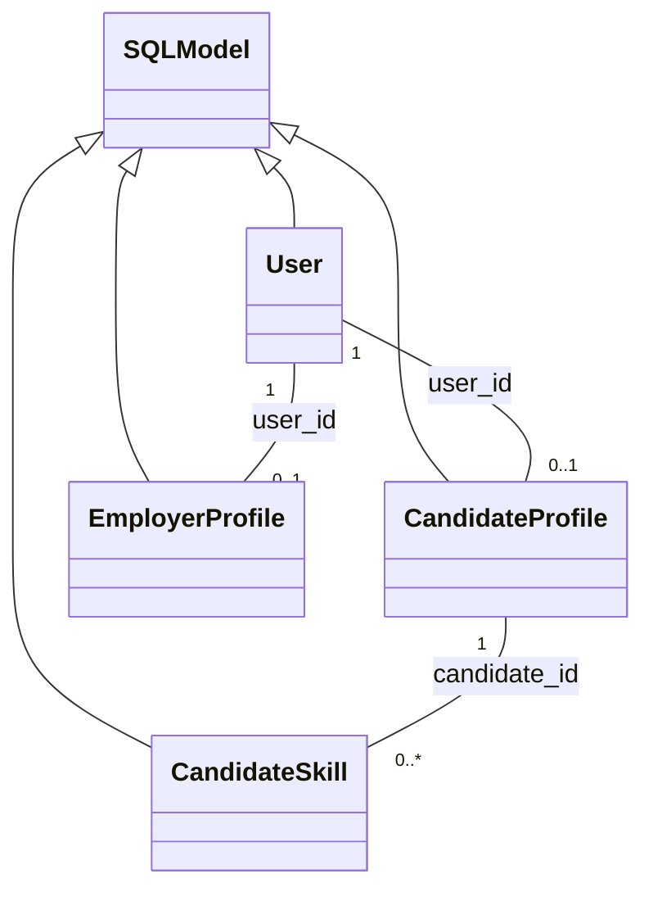
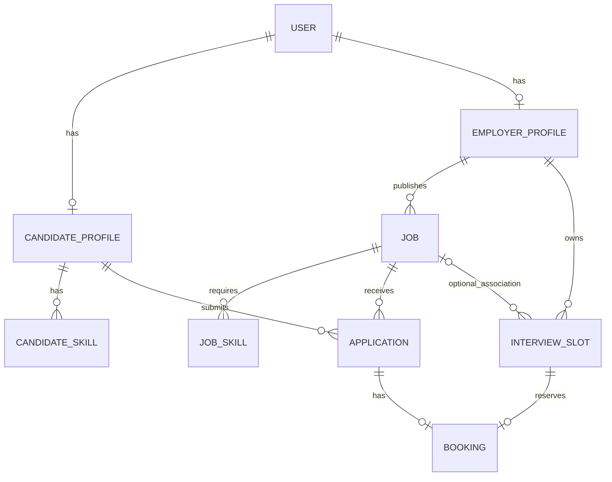

# 数据模型设计

依据：[REQUIREMENTS 中文翻译.md](../REQUIREMENTS%20中文翻译.md)。

本文区分已实现的用户模型和后续业务模型建议，不表示后续模块已完成。

## 1. 用户模块的需求与实现

相关需求摘录：

- FP-AUTH-1：恰好支持 Candidate 与 Employer；注册、登录、登出；邮箱或用户名唯一。
- FP-AUTH-2：保存密码哈希；认证机密不得返回给前端。
- FP-AUTH-3：受保护操作必须在服务端检查角色和所有权。
- FP-CAN-1：候选人只能查看和编辑自己的资料，包含显示名称、持久化技能和一份私有纯文本简历；其他候选人及雇主访问其简历必须返回 403。
- FP-EMP-1：雇主可查看和编辑自己的公司名称与描述。
- FP-MATCH-1：技能需去首尾空白、转小写、去空项、去重；匹配只使用技能，不使用简历。

已在 `backend/app/users/model.py` 定义以下四张表。

| 模型 / 表 | 字段 | 约束及作用 |
| --- | --- | --- |
| User / user | id、email、hashed_password、role、created_at | UUID 主键；email 唯一且非空；角色仅 candidate / employer；时间使用带时区的 UTC |
| CandidateProfile / candidate_profile | user_id、display_name、resume_text | user_id 同时是主键和 User 外键，一账户至多一份候选人资料；简历默认空字符串 |
| EmployerProfile / employer_profile | user_id、company_name、company_description | user_id 同时是主键和 User 外键，一账户至多一份雇主资料；描述默认空字符串 |
| CandidateSkill / candidate_skill | candidate_id、name | 候选人资料外键；两字段组成主键，同一候选人的技能不能重复；CHECK 拒绝空值及不符合数据库 lower/trim 规则的名称 |

Role 是 Python 字符串枚举，成员为 `Role.Candidate` 和 `Role.Employer`；沿用当前文件已有的小写存储值 `candidate` / `employer`，分别对应需求中的 Candidate / Employer。数据库采用字符串加 CHECK 约束，不创建 PostgreSQL 原生枚举类型。

技能规范化由后续写入服务执行，数据库 CHECK 仅提供额外保障；SQL 的 trim/lower 与 Python 对全部 Unicode 空白及大小写的处理不完全相同，不能代替需求中的规范化函数。用户模型暂不包含技能匹配函数。

`User.candidate_profile` 和 `User.employer_profile` 是标量关系；单个关系可不存在。按当前确定的产品流程，注册先创建 User，注册后再填写与 role 对应的资料。资料创建服务需检查角色与所有权，并在一个事务中写入资料及技能，不允许错配或同时创建两种资料。普通外键与上述主键只保证引用存在及一对一上限，并不自动保证角色匹配、资料必有且互斥。

后续响应 schema 必须显式选取允许返回的字段，不能直接返回 User 或把含 resume_text 的完整候选人资料嵌入雇主申请人响应。职位所属雇主可看申请人的身份和技能，仍不能看简历。

## 2. Python 继承与数据库关联

当前四个表模型均直接继承 SQLModel，并通过 `table=True` 注册为数据库表。CandidateProfile 和 EmployerProfile **不继承 User**，其共有的账户数据通过外键取得。

箭头表示 Python 继承，带数量的连线表示数据库关联。Role 继承 str 与 Enum，不是数据库表。

未来 Job、JobSkill、Application、InterviewSlot、Booking 也建议直接继承 SQLModel；不使用 User 作为这些业务表的 Python 父类。请求和响应模型属于 schema.py，与数据库表分开定义；确有重复字段时再提取非表的 Base 模型。

## 3. 后续业务模型建议（尚未实现）

| 模型 | 建议字段 | 约束 / 需求 |
| --- | --- | --- |
| Job | id、employer_id、title、description、created_at、updated_at | UUID 主键；employer_id 指向 EmployerProfile.user_id；标题和描述非空且不能仅含空白；FP-EMP-2 |
| JobSkill | job_id、name | 职位外键；组合主键；与 CandidateSkill 共用规范化规则；允许职位没有技能记录；FP-MATCH-1 |
| Application | id、candidate_id、job_id、status、created_at、updated_at | 候选人与职位外键；UNIQUE(candidate_id, job_id)；状态默认 Pending，仅允许 Pending / Interviewing / Rejected / Accepted；FP-CAN-3、FP-EMP-3 |
| InterviewSlot | id、employer_id、starts_at、ends_at、job_id（可空，待明确） | 雇主外键；带时区时间，建议存 UTC；结束恰好比开始晚 30 分钟；创建时必须在未来；FP-SCHED-1 |
| Booking | id、application_id、slot_id、created_at | 申请与时段外键；application_id、slot_id 各自非空且唯一；FP-SCHED-2、FP-SCHED-3 |

ID 建议使用 UUID。created_at / updated_at 是设计建议，不是所有表的强制需求；updated_at 应由编辑服务更新。

公司信息从 EmployerProfile 获取；申请所属雇主通过 Job 获取；预约所属候选人通过 Application 获取。避免重复存储这些可由外键确定的信息。

## 4. 删除、匹配与预约规则

### 职位删除

没有申请且没有关联面试时段时允许删除；存在其中任意一种记录时返回 409，全部记录保持不变。对申请和时段的职位外键采用限制删除，不能级联删除这些业务记录。删除允许的职位时，可以同时删除其 JobSkill。

### 时段与职位关联的待明确项

FP-EMP-2 提到职位关联的面试时段，但 FP-SCHED-1 只明确时段属于雇主。本文暂建议可空 job_id，表达可选职位关联，后续实现前需确定此设计。

FP-SCHED-2 的预约条件是时段属于申请对应的雇主，未要求时段与申请关联同一职位。因此不能仅凭存在 job_id 就额外限制预约资格。种子数据需让两名 Interviewing 候选人能竞争同一时段。

### 匹配分数

不把分数作为 Application 的固定字段；根据当前技能计算，候选人和雇主视图调用同一实现：所需技能为空时为 100，否则为 floor(100 × 交集数量 / 所需技能数量)。同分时分别按不区分大小写的职位标题 / 候选人显示名称，再按稳定的职位 / 候选人 ID 排序。

### 预约

事务中验证申请属于当前候选人、时段属于申请对应雇主、申请为 Interviewing、时段在未来且未预约、申请未有预约。通过 Booking 两个唯一约束保障一个申请最多一份预约及一个时段最多一次预约，并处理并发唯一性冲突。竞争同一时段失败返回 409，消息为 `Slot already booked`；其他约束冲突需分别处理，不能一律报告时段已预约。

已有预约的时段不能删除或显示为可用；申请离开 Interviewing 后预约仍保留。无需重复保存 is_booked，使用 Booking 是否存在判断占用。

## 5. 实现边界与数据库迁移

当前已定义用户表、ORM 关系及认证接口，并实现可复用的候选人 / 雇主角色依赖、两种资料首次创建接口和候选人技能规范化。上述后续业务表及匹配分数计算尚未实现。

模型定义不会自动创建或更新实际数据库。2026-10-06 已在 Alembic env.py 中显式导入用户模型，生成并审查初始迁移 `e07644577837`，按用户授权在当前配置的 PostgreSQL 执行 `alembic upgrade head`。现已创建 user、candidate_profile、employer_profile、candidate_skill 四张业务表及 Alembic 版本记录表。

建表后已检查邮箱唯一索引、角色 CHECK、技能组合主键和规范化 CHECK、资料 / 技能外键、带时区的创建时间；`alembic check` 确认实际结构与当前模型没有待迁移差异。实际服务对不存在账号的登录请求返回 401，原先因 user 表不存在而产生的 500 已消失。本次没有写入测试账户或种子数据。

## 6. 注册、登录与资料填写 schema

产品流程：注册只填邮箱、密码、角色；注册成功后由前端直接跳转到对应角色的基本资料填写页，无需账户响应提供资料完成状态。实际页面跳转尚未实现，schema 只是数据契约。

需求要求系统支持保存简历、技能和公司描述，但没有要求注册时填写，也没有要求这些内容非空。它们可以省略；候选人显示名称及公司名称在提交基本资料时要求非空，此为本项目的基本资料完成标准。

| Schema | 字段 / 用途 |
| --- | --- |
| UserCreate | email、password、role 必填；不接收 profile 字段 |
| UserLogin | email、password 必填；保留已有 remember_me，默认 false，其有效期策略尚未实现 |
| UserPublic | id、email、role；不包含密码、密码哈希、简历或旧模板的 username |
| Token | access_token、token_type（bearer） |
| AuthResponse | 继承 Token，增加 user: UserPublic；/users/register 和 /users/login 均返回此结构，注册成功后即签发 Token |
| CandidateProfileCreate | display_name 必填；resume_text 默认空字符串，skills 默认空列表 |
| EmployerProfileCreate | company_name 必填；company_description 默认空字符串 |
| CandidateProfileUpdate | display_name、resume_text、skills 均可省略，仅更新传入字段 |
| EmployerProfileUpdate | company_name、company_description 均可省略，仅更新传入字段 |
| CandidateProfilePublic | user_id、display_name、resume_text、skills；只能用于本人资料响应，不能用于雇主申请人列表 |
| EmployerProfilePublic | user_id、company_name、company_description |

所有请求 schema 继承 RequestSchema，拒绝未声明字段。ProfileUpdateSchema 在此基础上拒绝显式 null；两种资料 Update schema 继承它。所有响应 schema 不使用 table=True，不注册为数据库表。

“可选填写”采用省略字段的方式，不引入数据库 NULL：首次创建时使用空字符串 / 空列表默认值；局部更新时后续服务必须使用 `model_dump(exclude_unset=True)`，未传字段保持原值。提交 `resume_text: ""`、`skills: []` 或 `company_description: ""` 表示清空；显式 null 被拒绝。显示名称和公司名称去首尾空白后不能是空字符串。技能规范化仍由后续服务实现，schema 只检查列表及元素类型。

按用户确认的注册流程，不提供 profile_completed 字段，也不新增资料完成状态的服务计算逻辑。角色与资料一致性、简历所有权授权不能靠 schema 保证。

注册成功后前端保存 AuthResponse 中的访问令牌，直接跳转对应角色的资料填写页。/users/token 使用表单凭据并返回 Token，供 Swagger OAuth2 登录使用；/users/me 验证请求中的 Token，仅返回 UserPublic，不在响应中重复返回 Token。

## 7. 雇主资料首次创建接口

`POST /users/employer/profile` 使用 `EmployerProfileCreate` 请求和 `EmployerProfilePublic` 响应。公司名称去首尾空白后必须非空，公司描述可以省略并默认空字符串。成功返回 201；未认证 401；角色不符 403；已有资料 409；非法请求字段值 422。

router 使用 require_employer 取得当前用户，service 再检查角色并将其 ID 设为资料所有者。请求中额外提交的 user_id 按当前 schema 默认行为忽略，不会改变归属。公司资料一次提交，数据库异常时回滚；资料主键限制同一用户只能有一份公司资料，确认重复后转换为业务冲突，其他数据库异常不伪装为重复。

本接口不覆盖已有资料，不返回 Token；角色和资料 ID 取自认证结果。没有目标对象 ID，不另外定义对象缺失的 404。既有模型表结构未改变，此次未生成新结构迁移。

## 8. 候选人资料首次创建接口

`POST /users/candidate/profile` 使用 CandidateProfileCreate 请求和 CandidateProfilePublic 响应。display_name 去首尾空白后非空；resume_text 可省略并默认空字符串，skills 可省略并默认空列表。成功 201，未认证 401，角色不符 403，已有资料 409，非法字段值 422。

router 使用 require_candidate 获取认证用户，service 检查角色并设置资料所有者。normalize_skills 去首尾空白、转小写、去空项、去重并按名称排序；通过 CandidateProfile.skills 关系建立 CandidateSkill 记录，和资料在同一事务提交。失败时两张表的未提交写入全部回滚，重复创建不覆盖已有名称、简历或技能。

响应技能是规范化后的字符串列表，不是 ORM 对象；简历原文仅返回给当前候选人。额外提交的 user_id 不参与归属设置。此接口不提供他人资料读取入口，没有另外定义对象缺失的 404；角色检查不能替代后续读取 / 修改接口的所有权检查。现有表结构未变化，未新增结构迁移。
